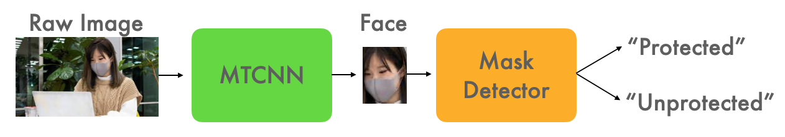

# cctv-mask-detector

This is the project page for the CCTV Mask Detector project that I did as part of my internship at Superb AI during the fall of 2020. 

Copyright 2020 Superb AI, Inc.\
The code and the models are all released under the Apache 2.0 license.\
Authors: Channy Hong

---

## Background

The year 2020 was shaped by the coronavirus pandemic in ways that pervaded our everyday lives. In particular, mask-wearing became the social norm for everyone when going outside. And because humans are animals of habits, one of the most common "oops, forgot to..." moments this year perhaps has been forgetting to put on one's mask before leaving the door. The same could be said for the wonderful folks at Superb AI's R&D office in Seoul as well, and I was musing with the idea of coming up with a really simple ML solution to this 'forgetting' problem.

On a separate note, I also wanted to internally test out the usefulness of Superb AI's Suite within a machine learning project workflow. During my internship, I was exposed to the various ways in which machine learning projects en route to deployment face obstacles and difficulties. And perhaps one of the most common challenges faced was in continuously integrating the data annotation process, which is absolutely essential in combating the ever-so prevalent problem of concept drift scenarios.

Concept drift occurs when deployed models assume that the incoming live data will be similar to that it was trained on. The fact of the matter is that it often is not the case - in some cases even impossible - that the data that our deployed model will predict on will be of the same distribution as the training data used to train it. In almost all cases, a subset of the live data must be continuosuly annotated and fed back into the training loop to make sure that our model doesn't degrade over time.

## Big Picture

The big picture of this project is to hook up our Arlo security camera (which films the front of the office entrance) with an ML model that detects whether folks leaving the office has their mask on or not. At the top level, our ML model would consist of the following:

1. Face recognition model that first identifies all the faces in a frame (bounding boxes).
2. Mask detection model that then classifies whether a given face is (a) 'protected' (aka masked) (b) or 'unprotected' (aka not masked)

And if less than 75% of folks in the frame are 'protected', then the model automatically triggers an announcement that yells "Don't forget to wear your mask correctly before leaving the office!"

## Implementation Strategy In Details

Now let's get down to the knitty-gritty. At first glance, it feels like this shouldn't be too too difficult a model to implement. 

As for the face recognition model, there already are many awesome face detection models (pretrained) available out and about the internet from which I can just pick out the face recognition portion. MTCNN (multi-task convolutional neural network) seems to do the trick well for the recognition portion, and I ultimately decided to use [timesler's facenet-pytorch project](https://github.com/timesler/facenet-pytorch) as a starting point. The repository comes with a pretrained MTCNN model (as separate ONet, PNet, RNet models) that can be adapted for our use.

The mask detection model should be even easier to implement. We can use one of many publicly available face mask datasets available on the internet to use as training data for the mask detection binary classifier model. Given the simplicity of the task at hand, we are just going to use a very simple CNN with two convolutional layers each with a pooling layer, followed by a feedforward layer that outputs a final confidence value for 'protected' versus 'unprotected'. I used [this dataset](https://www.kaggle.com/harry418/dataset-for-mask-detection) from Kaggle for training the detector.

Bootstrapping all this without having done any data labeling on our end, our project spec looks as the following:

Data:
- 'protected' class: from [this dataset](https://www.kaggle.com/harry418/dataset-for-mask-detection)
- 'unprotected' class: from [this dataset](https://www.kaggle.com/harry418/dataset-for-mask-detection)

Model Training
1. Use the pretrained MTCNN face recognition model from [timesler's facenet-pytorch project](https://github.com/timesler/facenet-pytorch) to extract faces.
2. Train the mask detection classifier using the resulting faces from the previous step.



## Implementation Code

I used Python 3.7.9 for this project. Make sure you have the following libraries installed in your environment:
- torch
- facenet_pytorch

**Project & Data Setup**

First I created an empty folder called 'mask_dataset' with the following structure
```
mask_dataset
    L train
        L protected
        L unprotected
    L test
        L protected
        L unprotected
```
by running these commands
```
mkdir mask_dataset
mkdir mask_dataset/train
mkdir mask_dataset/train/protected
mkdir mask_dataset/train/unprotected
mkdir mask_dataset/test
mkdir mask_dataset/test/protected
mkdir mask_dataset/test/unprotected
```

Then I downloaded [this dataset](https://www.kaggle.com/harry418/dataset-for-mask-detection) and divided up the images inside 'with_mask' and 'without_mask' folders into train and test examples. Then, I moved them into their respective folders. 
```
mask_dataset
    L train
        L protected
            L 1.jpeg
            L 2.jpeg
            L ...
        L unprotected
            L 1.jpeg
            L ...
    L test
        L ...
```

In my case, I allocated 500 images per class as train examples (1000 images for training in total) and the rest as test examples. Furthermore, I renamed all the image files in each of the 4 folders to be numerically ascending from 1, by running the following script.

```
python rename_image_files.py \
--rename_files_dir=mask_dataset/train/protected

python rename_image_files.py \
--rename_files_dir=mask_dataset/train/unprotected

python rename_image_files.py \
--rename_files_dir=mask_dataset/test/protected

python rename_image_files.py \
--rename_files_dir=mask_dataset/test/unprotected
```

**Train Mask Detection Classifier**

Now, we create a 'models' folder where we will be storing the output .pt model file.
```
mkdir models
```

Then, we run the training script on the training dataset.
```
python train_mask_detector.py \
--train_examples_path=mask_dataset/train \
--train_dataset_size_per_class=500 \
--batch_size_per_class=4 \
--num_epochs=50 \
--detector_model_output_path=models/detector.pt
```

When the training is complete, the output .pt model file will be in our 'models' folder. 

## Sanity Check

Now, we are going to test our MTCNN face recognizer + mask detection CNN models on the test dataset.

```
python test_detector.py \
--detector_model_path=models/detector.pt \
--test_examples_path=mask_dataset/test 
```

I got this message:
```
All done!
num_true_positive:  148
num_false_positive:  2
num_true_negative:  44
num_false_negative:  6
num_correct:  192
num_incorrect:  8
Accuracy:  0.96
```
96%... I think it's good enough to move on for now!

## Preliminary Testing

Now onto the real deal. We are going try testing our MTCNN face recognizer + mask detection CNN model on our Arlo security camera footage. Here's a raw footage of me walking into the office.


And now, the moment of truth! Let's try 


Right from the get-go, it's very apparent that . Similar to concept drift, I suspect that our model is going to have a hard time dealing with the low resolution and the . Similar to concept drift, the difference in the distribution of this live data from the training dataset will 

Since our footage is a video file, we are going to need to deconstruct them into individual frames before feeding them into our model. Then we draw bounding boxes + classify them frame by frame, and then we can reconstruct them back into video files for viewing. Upon deployment, this all can happen on-the-go using the live feed.

Deconstruct video files:
```
python deconstruct.py \
--data_dir=arlo_footage/raw_videos
``` 

Feed Arlo footage frames into our model:
```
python test.py \
--data_dir=arlo_footage/deconstructed_frames
``` 

Reconstruct video files:
```
python reconstruct.py
--data_dir=arlo_footage/output_frames
``` 

The reconstructed vidoes should now be in the 'reconstructed_videos' folder. An example of a reconstruction:

[gif image here showing utter failure]

As expected, our model does a terrible job at the moment even placing bounding boxes around faces. What should we do next?

## Finetuning To The Rescue (MTCNN)

So the very first (and a big one at that) problem we have is that the MTCNN face recognizer is not even picking up on folks' faces. This is a big problem, since our mask detection classifier very much depends on the output bounding boxes.

Okay, so it seems like we're going to need to annotate some live data on the go in order to finetune our MTCNN face recognizer. Time to unlock the powers of Superb AI's Suite!

First log into Superb AI's [Suite](https://suite.superb-ai.com/) (make a free account if you don't have one already) and make a new project. I chose 'image' as data type and 'box' as annotation type. I then added 3 classes to the project: 'correctly_masked', 'incorrectly_masked', and 'not_masked'.

EDIT: You can now use Suite's video data type to streamline the annotation process even more!

Then, in order to streamline this workflow, we are now going to hook our project to with our local dev environment. First, if you don't have the Suite CLI installed already, run:

```
pip install spb-cli
```

Then, we are going to need to authenticate our dev environment to the project. Get the account 'Access Key' from 'My Account > Advanced' menu, and keep it handy for the following command:

```
spb configure
Suite Account Name: [your account name, then press Enter]
Access Key: [the access key, then press Enter]
``` 

Now, we are going to upload our deconstructed frames onto Suite so we can distribute

```
spb upload arlo_footage/deconstructed_frames
Project Name: [project name, then press Enter]
Dataset Name: [dataset name, then press Enter]
``` 

For this project, I recruited the help of Kevin, Ike, Jack for the labeling process. From the Suite 'label list' section, I divied up the images into 4 cohorts and we each took about an hour labeling them (bounding box around each face).

[labeling example gif]

Now, let me export the labels so we can use them for the finetuning processes:

```
spb download
Project Name: [project name, then press Enter]
``` 

Okay, we are now ready to rumble with the finetuning process. I had to tinker with with [timesler's facenet-pytorch project](https://github.com/timesler/facenet-pytorch) quite a bit to isolate the MTCNN model. I also designed a custom loss function for this funetuning script. Anyways, run the following script to begin finetuning our MTCNN face recognizer model:

```
python finetune_mtcnn.py
```

[show gif of loss going down]

Okay, let's try running our model again and seeing how it works
```
python test.py \
--data_dir=arlo_footage/deconstructed_frames
``` 

Reconstruct video files:
```
python reconstruct.py
--data_dir=arlo_footage/output_frames
``` 

The face recognizing part is working great now, but the mask detection portion is still quite dysfunctional... Well, good thing we did classification (on top of bounding boxes) while we were annotating! Time to put these pieces of data to use as well!

## Finetuning Cont'd (Mask Detection CNN)

We are now going to finetune our using the bounding box classification data we have from the labels. Same as before, we first extract the faces from the Arlo deconstructed frames using the following script:
```
python extract_faces.py
```

Then, we finetune our mask detection CNN model further:
```
python train_mask_detection_model.py
```

## Final Result

Now let's test out our fully finetuned model on the Arlo footage frames:
```
python test.py \
--data_dir=arlo_footage/deconstructed_frames
``` 

Reconstruct video files:
```
python reconstruct.py
--data_dir=arlo_footage/output_frames
``` 

Hooray, now the model seems to be a great job both recognizing faces and classifying whether folks are correctly masked, incorrectly masked, or not masked at all!

## Continuing Edge Cases

[edge cases still appear... we need to continuosly integrate labeling]

## Integrating Labeling Work Into MLOps Using Superb AI's Suite

[MLOPs code]

